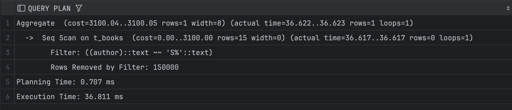

# Задание 1: BRIN индексы и bitmap-сканирование

1. Удалите старую базу данных, если есть:
   ```shell
   docker compose down
   ```

2. Поднимите базу данных из src/docker-compose.yml:
   ```shell
   docker compose down && docker compose up -d
   ```

3. Обновите статистику:
   ```sql
   ANALYZE t_books;
   ```

4. Создайте BRIN индекс по колонке category:
   ```sql
   CREATE INDEX t_books_brin_cat_idx ON t_books USING brin(category);
   ```

5. Найдите книги с NULL значением category:
   ```sql
   EXPLAIN ANALYZE
   SELECT * FROM t_books WHERE category IS NULL;
   ```
   
   *План выполнения:*
   
   *Объясните результат:*

   - BRIN индекс фиксирует наличие значений NULL и не NULL, что позволяет исключать страницы диска без нужной информации
   - Планировщик использовал Bitmap Index Scan с BRIN для отсеивания ненужных страниц, а затем применил Bitmap Heap Scan
для проверки оставшихся страниц на соответствие условию category is NULL


6. Создайте BRIN индекс по автору:
   ```sql
   CREATE INDEX t_books_brin_author_idx ON t_books USING brin(author);
   ```

7. Выполните поиск по категории и автору:
   ```sql
   EXPLAIN ANALYZE
   SELECT * FROM t_books 
   WHERE category = 'INDEX' AND author = 'SYSTEM';
   ```
   
   *План выполнения:*
   
   *Объясните результат (обратите внимание на bitmap scan):*
   
   - BRIN применялся для исключения страниц, которые точно не имеют записей с category='INDEX'
   - Видимо планировщик оценил это как эффективное решение, так как в колонке category присутствует ограниченное количество значений 


8. Получите список уникальных категорий:
   ```sql
   EXPLAIN ANALYZE
   SELECT DISTINCT category 
   FROM t_books 
   ORDER BY category;
   ```
   
   *План выполнения:*
   
   *Объясните результат:*
   
   - Индексы не сыграли роли, поскольку BRIN индексы не подходят для извлечения уникальных значений
   - Для выполнения операции DISTINCT планировщику необходимо обработать каждую строку, чтобы удостовериться в их уникальности


9. Подсчитайте книги, где автор начинается на 'S':
   ```sql
   EXPLAIN ANALYZE
   SELECT COUNT(*) 
   FROM t_books 
   WHERE author LIKE 'S%';
   ```
   
   *План выполнения:*
   
   *Объясните результат:*

   - Индексы не использовались, так как они содержат лишь минимальные и максимальные значения для блоков страниц, а не данные о каждой отдельной строке
   - Если в блоке присутствует хотя бы одна строка, начинающаяся на "S", то весь блок будет включён в результаты, даже если остальные строки не соответствуют критериям
   - Из-за отсутствия сортировки данных эффективность BRIN индексов значительно снижается


10. Создайте индекс для регистронезависимого поиска:
    ```sql
    CREATE INDEX t_books_lower_title_idx ON t_books(LOWER(title));
    ```

11. Подсчитайте книги, начинающиеся на 'O':
    ```sql
    EXPLAIN ANALYZE
    SELECT COUNT(*) 
    FROM t_books 
    WHERE LOWER(title) LIKE 'o%';
    ```
   
   *План выполнения:*
   
   *Объясните результат:*

   - Индекс не применялся, так как требуется обработка всех строк для приведения к нижнему регистру, что не ускоряет поиск


12. Удалите созданные индексы:
    ```sql
    DROP INDEX t_books_brin_cat_idx;
    DROP INDEX t_books_brin_author_idx;
    DROP INDEX t_books_lower_title_idx;
    ```

13. Создайте составной BRIN индекс:
    ```sql
    CREATE INDEX t_books_brin_cat_auth_idx ON t_books 
    USING brin(category, author);
    ```

14. Повторите запрос из шага 7:
    ```sql
    EXPLAIN ANALYZE
    SELECT * FROM t_books 
    WHERE category = 'INDEX' AND author = 'SYSTEM';
    ```
   
   *План выполнения:*
   
   *Объясните результат:*

   - Составной индекс ускорил запрос
   - Составной индекс определяет диапазон значений по category и author для одних и тех же блоков 
   - Это улучшает фильтрацию запросов, комбинирующих category и author 
