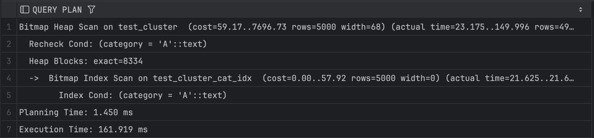
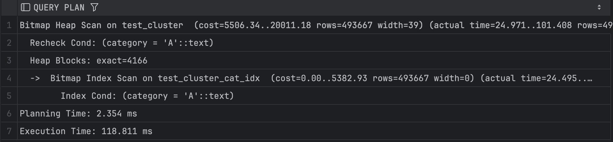

## Задание 3

1. Создайте таблицу с большим количеством данных:
    ```sql
    CREATE TABLE test_cluster AS 
    SELECT 
        generate_series(1,1000000) as id,
        CASE WHEN random() < 0.5 THEN 'A' ELSE 'B' END as category,
        md5(random()::text) as data;
    ```

2. Создайте индекс:
    ```sql
    CREATE INDEX test_cluster_cat_idx ON test_cluster(category);
    ```

3. Измерьте производительность до кластеризации:
    ```sql
    EXPLAIN ANALYZE
    SELECT * FROM test_cluster WHERE category = 'A';
    ```
    
    *План выполнения:*
    
    *Объясните результат:*

   - Несмотря на использование индекса, общее время выполнения оказалось долгим из-за большого объема данных 
   - Также влияет количество строк, соответствующих условию


4. Выполните кластеризацию:
    ```sql
    CLUSTER test_cluster USING test_cluster_cat_idx;
    ```
    
    *Результат:*
    


5. Измерьте производительность после кластеризации:
    ```sql
    EXPLAIN ANALYZE
    SELECT * FROM test_cluster WHERE category = 'A';
    ```
    
    *План выполнения:*
    
    *Объясните результат:*

   - Время выполнения уменьшилось, но все еще остается довольно долгой 
   - Это связано с большим количеством строк, соответствующих условию


6. Сравните производительность до и после кластеризации:
    
    *Сравнение:*
   - Как уже говорилось выше, после кластеризации производительность незначительно улучшилась
   - Кластеризация сократила количество блоков, которые нужно обрабатывать при выполнении запроса
